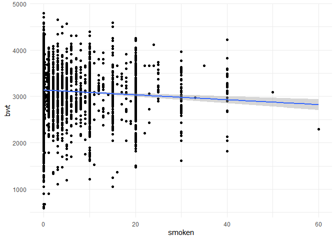
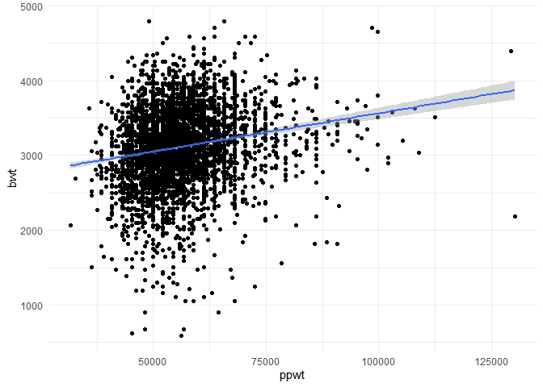
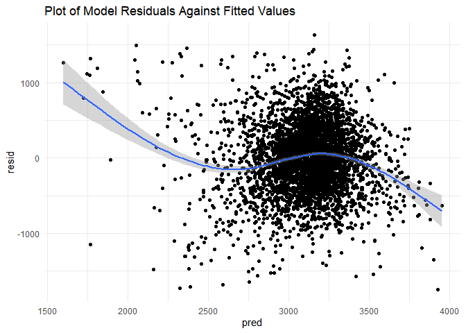

hw6
================
Lulu Zhang
11/21/2019

# Problem 1

I will load and tidy the dataset `birthweight` for regression analysis.
I converted `frace`, `mrace`, `babysex`, and `malform` to factors;
confirmed no missing variables; and standardized variables to the metric
system, so I converted `delwt`, `ppwt`, and `wtgain`, from pounds to
grams, and `mheight` from inches to cm.

``` r
# load data
bwt_data = read.csv("./birthweight.csv") %>% 
  janitor::clean_names() %>% 
  mutate(
   frace = as.factor(frace),
   frace = recode(frace,
    "1" = "White", 
    "2" = "Black", 
    "3" = "Asian", 
    "4" = "Puerto Rican", 
    "8" = "Other", 
    "9" = "Unknown"),
   mrace = as.factor(mrace),
   mrace = recode(mrace, 
    "1" = "White", 
    "2" = "Black", 
    "3" = "Asian", 
    "4" = "Puerto Rican", 
    "8" = "Other"),
   babysex = as.factor(babysex),
   babysex = recode(babysex, 
     "1" = "male", 
    "2" = "female"),
   malform = as.factor(malform),
   malform = recode(malform,
    "0" = "absent", 
    "1" = "present"),
   delwt = 453.592*delwt, 
   ppwt = 453.592*ppwt, 
   wtgain = 453.592*wtgain, 
   mheight = 2.54*mheight)
  
anyNA(bwt_data)
```

    ## [1] FALSE

``` r
# no missing values
```

Proposing a model for birthweight. I hypothesize that `mrace`: mother’s
race, `gaweeks`: gestational age in weeks, `pnumlbw`: previous number of
low birth weight babies,`ppbmi`:mother’s pre-pregnancy BMI, `smoken`:
average number of cigarettessmoked per day during pregnancy, and `ppwt`:
mother’s pre-pregnancy weight are a few of the factors that influence
baby’s birthweight (outcome). I will test each of these variables
separately to see if they are significantly associated with `bwt` by
running a linear regression model and assessing the plots to see if they
appear to be significantly associated. If they are, I will include them
in my final model as a predictor of `bwt`.

Testing significance of each hypothesized variable separately, I can
look to see if the p-value \< 0.05, or if there appears to be a linear
association in the plots.

Testing `mrace`, the p-values are all \< 0.05 except for Asian,
indicating a significant relationship between mother’s race and
birthweight.

``` r
mrace_model = lm(bwt ~ mrace, data = bwt_model) %>% 
  broom::tidy() %>% 
  select(term, estimate, p.value) %>% 
  knitr::kable(digits = 4)

mrace_model
```

| term              |   estimate | p.value |
| :---------------- | ---------: | ------: |
| (Intercept)       |  3266.6628 |  0.0000 |
| mraceBlack        | \-316.5638 |  0.0000 |
| mracePuerto Rican | \-211.3212 |  0.0000 |
| mraceAsian        | \-126.4302 |  0.0932 |

Testing `gaweeks`, it appears to be significantly associated with `bwt`
when looking at the p-value and the graph.

``` r
gaweeks_model = lm(bwt ~ gaweeks, data = bwt_model) %>% 
  broom::tidy() %>% 
  select(term, estimate, p.value) %>% 
  knitr::kable(digits = 4)

gaweeks_model 
```

| term        | estimate | p.value |
| :---------- | -------: | ------: |
| (Intercept) | 476.0026 |       0 |
| gaweeks     |  66.9199 |       0 |

``` r
bwt_model %>% 
  ggplot(aes(x = gaweeks, y = bwt))+
  geom_point()+
  geom_smooth(method = 'lm')
```

<!-- -->

Testing `pnumlbw`, it does not appear to be significantly associated
with birthweight.

``` r
pnumlbw_model = lm(bwt ~ pnumlbw, data = bwt_model) %>% 
  broom::tidy() %>% 
  select(term, estimate, p.value) %>% 
  knitr::kable(digits = 4)

pnumlbw_model
```

| term        | estimate | p.value |
| :---------- | -------: | ------: |
| (Intercept) | 3114.404 |       0 |

``` r
bwt_model %>% 
  ggplot(aes(x = pnumlbw, y = bwt))+
  geom_point()+
  geom_smooth(method = 'lm')
```

<!-- -->

Testing `ppbmi`, it does appear to be significantly associated with
birthweight based on the p-values and plot.

``` r
ppbmi_model = lm(bwt ~ ppbmi, data = bwt_model) %>% 
  broom::tidy() %>% 
  select(term, estimate, p.value) %>% 
  knitr::kable(digits = 4)

ppbmi_model
```

| term        |  estimate | p.value |
| :---------- | --------: | ------: |
| (Intercept) | 2788.2519 |       0 |
| ppbmi       |   15.1204 |       0 |

``` r
bwt_model %>% 
  ggplot(aes(x = ppbmi, y = bwt))+
  geom_point()+
  geom_smooth(method = 'lm')
```

<!-- -->

Testing `smoken`: it does not appear to be significantly associated with
birthweight when looking at the plot.

``` r
smoken_model = lm(bwt ~ smoken, data = bwt_model) %>% 
  broom::tidy() %>% 
  select(term, estimate, p.value) %>% 
  knitr::kable(digits = 4)

smoken_model
```

| term        |  estimate | p.value |
| :---------- | --------: | ------: |
| (Intercept) | 3136.0786 |       0 |
| smoken      |  \-5.2289 |       0 |

``` r
bwt_model %>% 
  ggplot(aes(x = smoken, y = bwt))+
  geom_point()+
  geom_smooth(method = 'lm')
```

<!-- -->

Looking at `ppwt`, it does seem to be significantly associated with
birthweight.

``` r
ppwt_model = lm(bwt ~ ppwt, data = bwt_model) %>% 
  broom::tidy() %>% 
  select(term, estimate, p.value) %>% 
  knitr::kable(digits = 3)

ppwt_model
```

| term        | estimate | p.value |
| :---------- | -------: | ------: |
| (Intercept) | 2540.669 |       0 |
| ppwt        |    0.010 |       0 |

``` r
bwt_model %>% 
  ggplot(aes(x = ppwt, y = bwt))+
  geom_point()+
  geom_smooth(method = 'lm')
```

<!-- -->

My final model with the significant variables associated with `bwt`:

``` r
final_model = lm(bwt ~ mrace + gaweeks + ppwt + ppbmi, data = bwt_model) %>% 
  broom::tidy() %>% 
  knitr::kable(digits = 3)
final_model
```

| term              |  estimate | std.error | statistic | p.value |
| :---------------- | --------: | --------: | --------: | ------: |
| (Intercept)       |   540.332 |    96.794 |     5.582 |   0.000 |
| mraceBlack        | \-238.527 |    14.225 |  \-16.768 |   0.000 |
| mracePuerto Rican |  \-84.850 |    30.789 |   \-2.756 |   0.006 |
| mraceAsian        |  \-31.315 |    68.493 |   \-0.457 |   0.648 |
| gaweeks           |    58.123 |     2.171 |    26.776 |   0.000 |
| ppwt              |     0.017 |     0.001 |    11.818 |   0.000 |
| ppbmi             |  \-26.266 |     4.146 |   \-6.336 |   0.000 |

Next, I will plot of model residuals against fitted values. There does
not appear to be a distinct trend in the plot, there is a large cluster
but no apparent positive or negative trend for my model.

``` r
bwt_resid = bwt_model %>% 
  modelr::add_residuals(fit_model) %>% 
  modelr::add_predictions(fit_model)%>% 
  ggplot(aes(x = pred, y = resid))+
  geom_point()+
  geom_smooth()+
  labs(title = "Plot of Model Residuals Against Fitted Values")

bwt_resid
```

    ## `geom_smooth()` using method = 'gam' and formula 'y ~ s(x, bs = "cs")'

<!-- -->

Compare your model to two others:

One using length at birth and gestational age as predictors (main
effects only) One using head circumference, length, sex, and all
interactions (including the three-way interaction) between these

``` r
# main effects model

fit_main = lm(bwt ~ blength + gaweeks, data = bwt_data)
fit_main %>% 
  broom::tidy() %>% 
  select(term, estimate, p.value) %>% 
  rename(
    "Term" = "term",
    "Estimate" = "estimate",
    "p-value" = "p.value") %>% 
  knitr::kable(digits = 4)
```

| Term        |    Estimate | p-value |
| :---------- | ----------: | ------: |
| (Intercept) | \-4347.6671 |       0 |
| blength     |    128.5557 |       0 |
| gaweeks     |     27.0467 |       0 |

``` r
# interactions model
fit_interact = lm(bwt ~ bhead + blength + babysex + bhead * blength + bhead * babysex + blength * babysex +  bhead * blength * babysex, data = bwt_data)
fit_interact %>%
  broom::tidy() %>% 
  select(term, estimate, p.value) %>% 
  rename(
    "Term" = "term",
    "Estimate" = "estimate",
    "p-value" = "p.value") %>% 
  knitr::kable(digits = 4)
```

| Term                        |    Estimate | p-value |
| :-------------------------- | ----------: | ------: |
| (Intercept)                 | \-7176.8170 |  0.0000 |
| bhead                       |    181.7956 |  0.0000 |
| blength                     |    102.1269 |  0.0001 |
| babysexfemale               |   6374.8684 |  0.0001 |
| bhead:blength               |    \-0.5536 |  0.4780 |
| bhead:babysexfemale         |  \-198.3932 |  0.0001 |
| blength:babysexfemale       |  \-123.7729 |  0.0004 |
| bhead:blength:babysexfemale |      3.8781 |  0.0002 |

``` r
# cross validation prediction error

cv = crossv_mc(bwt_data, 100)

cv_x = cv %>% 
  mutate(
    final_model = map(train, ~lm(bwt ~ mrace + gaweeks + ppwt + ppbmi + smoken, data = bwt_model)),
    fit_main = map(train, ~lm(bwt ~ blength + gaweeks, data = bwt_data)),
    fit_interact = map(train, ~lm(bwt ~ bhead + blength + babysex + bhead * blength + bhead * babysex + blength * babysex +  bhead * blength * babysex, data = bwt_data)),
    rmse_final = map2_dbl(final_model, test, ~rmse(model = .x, data = .y)),
    rmse_main = map2_dbl(fit_main, test, ~rmse(model = .x, data = .y)),
    rmse_interact = map2_dbl(fit_interact, test, ~rmse(model = .x, data = .y))
  )

cv_x %>% 
  select(starts_with("rmse")) %>% 
  pivot_longer(
    everything(),
    names_to = "model",
    values_to = "rmse",
    names_prefix = "rmse_")%>% 
  mutate(
    model = fct_inorder(model)) %>% 
  ggplot(aes(x = model, y = rmse))+
  geom_violin()+
  labs(title = "Cross validated prediction errors")
```

<!-- -->
The RMSEs for my final model are much larger than the main effects model
and the interactions model. The interaction model has the lowest RMSE
values indicating that the `interact` model had the best fit, and my
`final` model had the poorest fit because the residuals were further
away from the regression line data points.

# Problem 2

``` r
weather_df = 
  rnoaa::meteo_pull_monitors(
    c("USW00094728"),
    var = c("PRCP", "TMIN", "TMAX"), 
    date_min = "2017-01-01",
    date_max = "2017-12-31") %>%
  mutate(
    name = recode(id, USW00094728 = "CentralPark_NY"),
    tmin = tmin / 10,
    tmax = tmax / 10) %>%
  select(name, id, everything())
```

    ## Registered S3 method overwritten by 'crul':
    ##   method                 from
    ##   as.character.form_file httr

    ## Registered S3 method overwritten by 'hoardr':
    ##   method           from
    ##   print.cache_info httr

    ## file path:          C:\Users\lzhang24\AppData\Local\rnoaa\rnoaa\Cache/ghcnd/USW00094728.dly

    ## file last updated:  2019-09-26 10:19:38

    ## file min/max dates: 1869-01-01 / 2019-09-30

``` r
set.seed(1)
```

I used 5000 bootstrap samples and, for each bootstrap sample, produced
estimates of r^2 and log(beta0\*beta1). Then I plotted the distribution
of my estimates. Then using the 5000 bootstrap estimates, I identified
the 2.5% and 97.5% quantiles to provide a 95% confidence interval for
r^2 and log(β<sup>0∗β</sup>1).

``` r
weather_bs = weather_df %>% 
  modelr::bootstrap(n = 5000) %>% 
  mutate(
    models = map(strap, ~lm(tmax ~ tmin, data = .x)),
    results = map(models, broom::tidy),
    glanced = map(models, broom::glance)) %>% 
  unnest(glanced, results) %>% 
  select(.id, r.squared, estimate, term)
   

 new_weather_bs = weather_bs %>% 
  select(-.id) %>% 
  pivot_wider(
    names_from = term,
    values_from = estimate) %>% 
  rename(
    b0 = `(Intercept)`,
    b1 = tmin) %>% 
  mutate(log_betas = log(b0*b1))
```

``` r
# r^2 plot
new_weather_bs %>% 
  ggplot(aes(x = r.squared))+
  geom_density()+
  labs(title = "Plot showing distribution of r squared estimates",
       x = "r squared estimates")
```

<!-- -->

``` r
# log(beta0*beta1)
new_weather_bs %>% 
  ggplot(aes(x = log_betas))+
  geom_density()+
  labs(title = "Plot showing distribution of log(b0*b1) estimates",
       x = "log(beta0*beta1) estimates")
```

<!-- -->

Both the plot showing the r^2 values and the `log(beta0*beta1)` both
have an apporximately normal distribution. The r^2 plot shows the
distribution of the total portion of variation in `tmax` due to `tmin`
for the 5000 bootstrap samples produced. The mean r^ value appears to be
around 0.91. The plot of the distribution of `log(b0*b1)` also follows
an approx. normal distribution, with the mean centering around 2.01. The
max density for the plot showing the distributon of `log(b1*b0)`
estimates is slightly lower than the plot showing the distribution of
r^2 estimates.

The 95% CI for r^2 is 0.89, 0.93. The 95% CI for log(b0\*b1) 1.96, 2.06.
